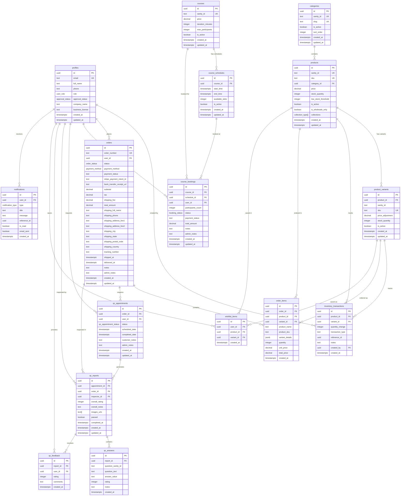
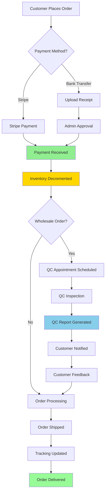
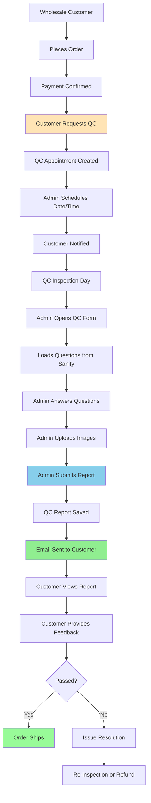
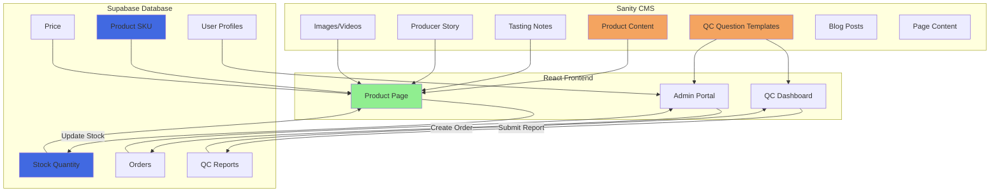

# The Espresso Lab - Database Schema Diagram

## Entity Relationship Diagram (ERD)



## Data Flow Diagrams

### 1. Order Processing Flow



### 2. Quality Control Flow



### 3. Inventory Real-Time Update Flow

```mermaid
flowchart LR
    A[React Frontend] --> B[Add to Cart]
    B --> C{Check Stock}
    
    C -->|Query| D[(Supabase Products)]
    D -->|Stock Available| E[Enable Checkout]
    D -->|Out of Stock| F[Disable Button]
    
    E --> G[Order Placed]
    G --> H[Payment Confirmed]
    H --> I[Trigger: decrement_inventory]
    
    I --> J[Update stock_quantity]
    J --> K[Log inventory_transactions]
    K --> L[Realtime Broadcast]
    
    L --> M[Admin Dashboard]
    L --> N[Product Page]
    
    M --> O[Update Stock Display]
    N --> P[Update Add to Cart Button]
    
    style D fill:#4169E1
    style I fill:#FF6347
    style L fill:#FFD700
    style O fill:#90EE90
    style P fill:#90EE90
```



### 4. Hybrid Data Architecture (Sanity + Supabase)



## Key Design Decisions

### 1. **Hybrid Data Model**
- **Sanity**: Rich content (descriptions, images, stories, QC templates)
- **Supabase**: Operational data (stock, prices, orders, real-time updates)
- **Sync Point**: `sanity_id` field links Supabase records to Sanity documents

### 2. **Real-Time Inventory**
- Triggers automatically decrement stock on payment confirmation
- Realtime subscriptions push updates to all connected clients
- Inventory transactions table provides complete audit trail

### 3. **Quality Control Integration**
- QC appointments linked directly to orders
- Question templates stored in Sanity for easy updates
- Answers stored in Supabase with snapshots for historical accuracy
- Images stored in Supabase Storage

### 4. **Wholesale vs Retail**
- Single unified system with role-based access
- `is_wholesale_only` flag on products
- `approval_status` on profiles gates wholesale access
- QC module only activated for wholesale orders

### 5. **Order Status Progression**
```
pending_payment → payment_received → processing → 
qc_scheduled (wholesale only) → qc_completed → 
shipped → delivered
```

### 6. **Security Layers**
- Row Level Security (RLS) policies (see separate file)
- Role-based access control (customer, wholesale, admin)
- Approval workflow for wholesale accounts
- Audit trails via inventory_transactions and timestamps

## Table Relationships Summary

| Parent Table | Child Table | Relationship Type | Key Field |
|--------------|-------------|-------------------|-----------|
| profiles | orders | One-to-Many | user_id |
| profiles | qc_appointments | One-to-Many | user_id |
| profiles | course_bookings | One-to-Many | user_id |
| orders | order_items | One-to-Many | order_id |
| orders | qc_appointments | One-to-Many | order_id |
| orders | qc_reports | One-to-Many | order_id |
| products | order_items | One-to-Many | product_id |
| products | product_variants | One-to-Many | product_id |
| products | inventory_transactions | One-to-Many | product_id |
| qc_appointments | qc_reports | One-to-Many | appointment_id |
| qc_reports | qc_answers | One-to-Many | report_id |
| qc_reports | qc_feedback | One-to-Many | report_id |
| courses | course_schedules | One-to-Many | course_id |
| course_schedules | course_bookings | One-to-Many | schedule_id |

## Storage Buckets (Supabase Storage)

```
espressolab-storage/
├── qc-images/              # QC inspection photos
│   └── {report_id}/
│       ├── image1.jpg
│       └── image2.jpg
├── bank-receipts/          # Bank transfer receipts
│   └── {order_id}/
│       └── receipt.pdf
├── product-images/         # Product photos (if not in Sanity)
└── documents/              # Roasting PDFs, certificates
    └── {product_id}/
        └── roasting-profile.pdf
```
